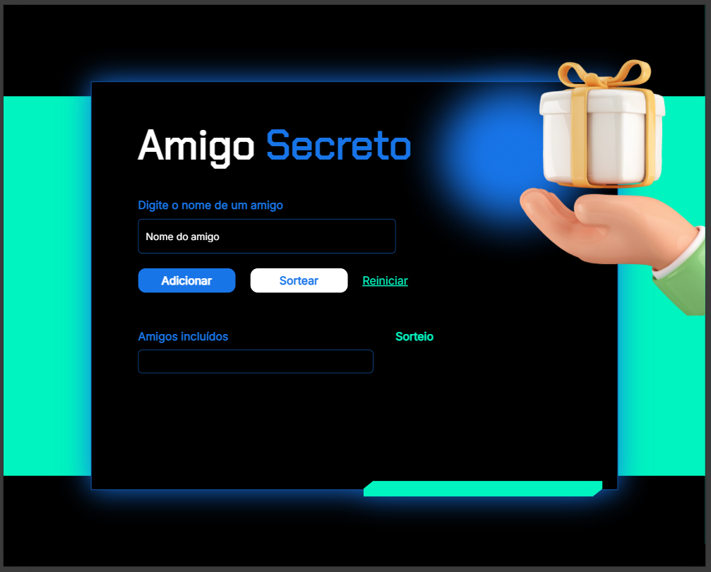

# Sorteador de Amigo Secreto

Uma aplicação web minimalista para realizar sorteios de amigo secreto de forma justa e aleatória, utilizando JavaScript puro.

## 🎯 Objetivo
Projeto desenvolvido para praticar lógica de programação e manipulação do DOM, com foco em:
- Validação de dados
- Implementação de algoritmos
- Interatividade com JavaScript

## 🚀 Funcionalidades
- Adição de participantes
- Validação de entrada:
  - Impede nomes vazios
  - Impede nomes duplicados (case-insensitive)
- Sorteio aleatório utilizando o algoritmo Fisher-Yates
- Garantia de que ninguém tire a si mesmo
- Reinicialização do sorteio

## 🛠️ Tecnologias
- HTML5
- CSS3
- JavaScript (ES6+)

## 📷 Preview

## 🔗 Acesso
https://sorteador-amigo-secreto-beryl.vercel.app/#

## 📚 Aprendizados
- Manipulação do DOM com JavaScript puro
- Implementação do algoritmo Fisher-Yates
- Validação de entradas de usuário
- Organização de lógica para evitar estados inválidos
